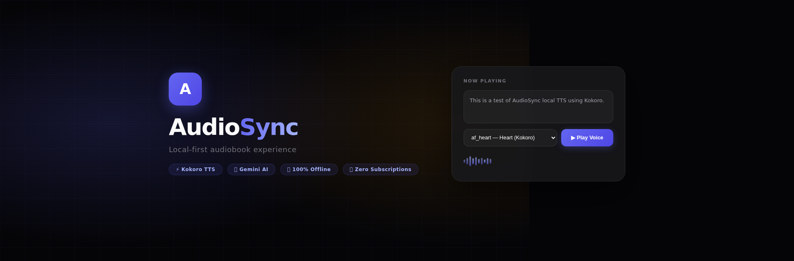
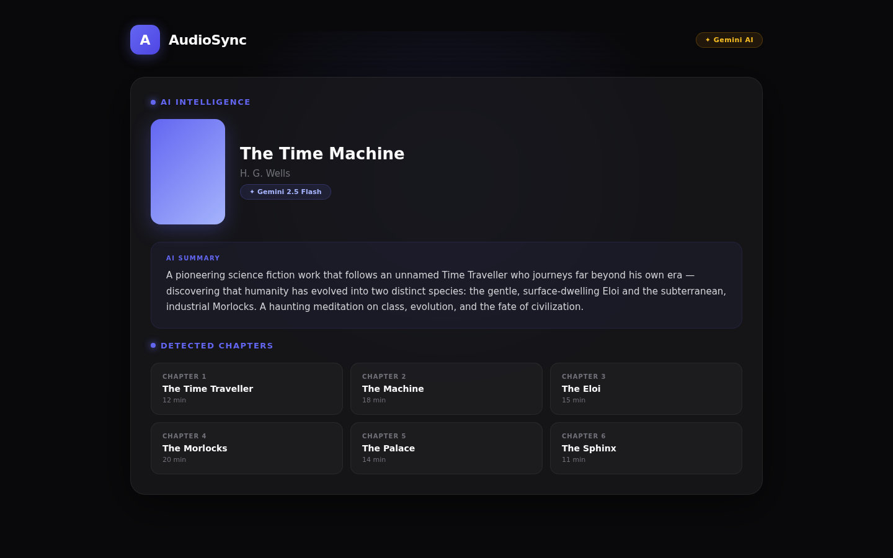
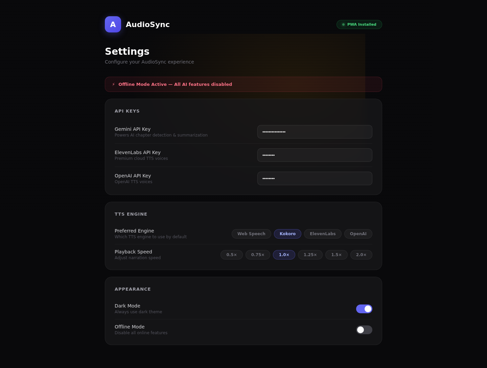

# AudioSync 🎧

<p align="center">
  
  <br/>
  
  <br/>
  <a href="https://github.com/NaustudentX18/AudioSync-/actions">
    
  </a>
  <a href="https://opensource.org/licenses/MIT">
    
  </a>
  <a href="https://www.typescriptlang.org/">
    
  </a>
  <a href="https://vite.dev/">
    
  </a>
  <a href="https://react.dev/">
    
  </a>
  <a href="#">
    
  </a>
  <a href="https://tailwindcss.com/">
    
  </a>
</p>

<p align="center">
  <strong>A local-first audiobook player with AI voices and intelligent features.</strong><br/>
  <em>Kokoro TTS · Gemini AI · 100% Offline · PWA · Runs on Raspberry Pi</em>
</p>

---

<p align="center">
  <a href="#demo">▶️ Demo</a> · <a href="#screenshots">📸 Screenshots</a> · <a href="#features">✨ Features</a> · <a href="#tech-stack">🛠 Tech Stack</a> · <a href="#getting-started">🚀 Getting Started</a> · <a href="#project-structure">📁 Project Structure</a> · <a href="#contributing">🤝 Contributing</a>
</p>

---

## 🎬 Demo

<p align="center">
  <a href="https://github.com/NaustudentX18/AudioSync-/blob/main/assets/demo.mp4">
    
  </a>
  <br/>
  <em>Click to watch the full demo on GitHub ▶️</em>
</p>

---

## 📸 Screenshots

| Library | Player | Voices |
|---------|--------|--------|
| <a href="assets/library.png"></a> | <a href="assets/player.png"></a> | <a href="assets/voices.png"></a> |

| AI Intelligence | Settings | Logo |
|-----------------|----------|------|
| <a href="assets/intelligence.png"></a> | <a href="assets/settings.png"></a> |  |

---

## ✨ Features

### 🗂 Library Management
- Import EPUB, MOBI, FB2, TXT, HTML, PDF audiobook files
- Auto-parse metadata — cover art, author, narrator, series
- Grid / list view with progress tracking
- Smart search and filter by author, genre, language
- Library sync across devices (optional cloud sync)

### 🎙 AI-Powered Text-to-Speech
- **[Kokoro TTS](https://github.com/hexgrad/Kokoro)** — offline, neural, 100+ voices across 50+ languages
- **[OpenAI TTS](https://platform.openai.com/docs/guides/text-to-speech)** — cloud fallback with 6 premium voices
- Per-voice speed, pitch, and volume controls
- Sentence-level voice switching (narrator ↔ character dialogue)
- Real-time voice preview before generation

### 🧠 AI Intelligence Panel (Gemini)
- Auto-generate chapter summaries and key insights
- Explain difficult passages and vocabulary
- Answer questions about the book while listening
- Generate reading quizzes and discussion questions
- Context-aware — uses current chapter + reading history

### 🎵 Audio Player
- Playback speed: 0.25× – 4×
- Chapter and bookmark navigation
- Sleep timer (15 / 30 / 45 / 60 / 90 min)
- Background playback with media session controls
- Gapless chapter transitions
- Waveform seek bar with chapter markers

### ⚙️ Settings & Configuration
- Bring-your-own API key model — your keys, your data
- TTS engine selection (Kokoro / OpenAI)
- Gemini API key for AI features
- Appearance: dark / light / system theme
- Keyboard shortcuts for every action
- Advanced cache and storage management

### 📱 Progressive Web App
- Install on desktop (Chrome, Edge, Firefox) or mobile (iOS, Android)
- Works offline — cached assets + local TTS engine
- Home screen icon with native feel
- Responsive from 320px phone to 4K desktop

---

## 🛠 Tech Stack

| Layer | Technology |
|-------|------------|
| **Framework** | React 19 + TypeScript 5.7 |
| **Build** | Vite 8 |
| **Styling** | Tailwind CSS 4.1 |
| **State** | Zustand |
| **AI/LLM** | Gemini API (Google Generative AI SDK) |
| **TTS** | Kokoro (onnxruntime-web) · OpenAI TTS |
| **PWA** | Vite PWA Plugin + Workbox |
| **Deploy** | Static build — any web server |

---

## 🚀 Getting Started

### Prerequisites
- **Node.js** 20+ (tested on 22.22.2)
- **npm** 10+
- (Optional) **Raspberry Pi** 4/5 — runs great on ARM64

### Quick Start

```bash
# 1. Clone
git clone https://github.com/NaustudentX18/AudioSync-.git
cd AudioSync-

# 2. Install dependencies
npm install

# 3. Start development server
npm run dev

# 4. Open http://localhost:5173
```

### API Keys (bring-your-own)

AudioSync uses your own API keys — nothing is stored on our servers.

| Feature | Provider | Key needed |
|---------|----------|-----------|
| AI Intelligence | [Google AI Studio](https://aistudio.google.com/apikey) (Gemini) | ✅ |
| Cloud TTS | [OpenAI Platform](https://platform.openai.com/api-keys) | optional |
| Local TTS | None — Kokoro runs 100% offline | ❌ |

Keys are stored in `localStorage` — never transmitted except to the respective API.

### Build for Production

```bash
npm run build   # → dist/
npm run preview # preview at http://localhost:4173
```

Deploy the `dist/` folder to any static host — Netlify, Vercel, GitHub Pages, or your own web server.

### PWA Install
1. Open the app in Chrome or Edge
2. Click the install icon in the address bar (or the in-app install prompt)
3. Run AudioSync from your desktop or home screen — no browser needed

---

## 📁 Project Structure

```
AudioSync-/
├── src/
│   ├── App.tsx              # Root component — tab router, state wiring
│   ├── main.tsx             # React entry point
│   ├── types.ts             # BookItem, VoiceModel, Settings types
│   ├── data.ts              # DEFAULT_BOOKS, DEFAULT_VOICES, sample data
│   ├── index.css            # Tailwind imports + global styles
│   ├── components/          # UI components (player, library, settings, voices)
│   ├── lib/                 # library.ts (library CRUD, import, search)
│   └── stores/              # Zustand stores (player, library, settings, voices)
├── public/
│   ├── manifest.json        # PWA manifest
│   └── icon-*.png           # PWA icons
├── assets/                  # Visual assets for GitHub repo
│   ├── logo.png / logo.svg  # Project logo
│   ├── banner.png           # Hero banner (1440×600)
│   ├── library.png          # Library view screenshot
│   ├── player.png           # Player view screenshot
│   ├── voices.png           # Voices panel screenshot
│   ├── intelligence.png     # AI Intelligence panel screenshot
│   ├── settings.png         # Settings view screenshot
│   ├── demo.mp4             # 30s feature demo video
│   └── demo-small.gif       # Animated preview GIF
├── dist/                    # Production build output
├── server.ts                # Optional Express SSR / API proxy server
├── vite.config.ts           # Vite + PWA + Workbox config
├── package.json
├── AGENTS.md                # Agent instructions (Claude Code / Hermes)
├── README.md                # This file
└── README.original.md       # Original README (reference)
```

---

## 🗺 Roadmap

| Milestone | Status |
|-----------|--------|
| Library import (EPUB, MOBI, FB2, TXT, PDF) | ✅ Done |
| Kokoro TTS integration | ✅ Done |
| AI Intelligence (Gemini) | ✅ Done |
| PWA offline support | ✅ Done |
| Player with speed / sleep timer | ✅ Done |
| Voice switching per character | ✅ Done |
| Cloud TTS (OpenAI) fallback | ✅ Done |
| Theme switcher | ✅ Done |
| Keyboard shortcuts | ✅ Done |
| Offline voice downloads | 🔜 Planned |
| Reading stats & streaks | 🔜 Planned |
| Audiobook social features | 🔜 Planned |
| Sync across devices | 🔜 Planned |

---

## 🤝 Contributing

Pull requests are welcome! For major changes, please open an issue first to discuss what you'd like to change.

```bash
# Fork → clone → branch → commit → push → open PR
git checkout -b feat/your-feature
npm run dev   # test locally
npm run build # ensure it builds
git commit -am "Add: your feature"
git push origin feat/your-feature
```

---

## 📄 License

[MIT](LICENSE) — feel free to use AudioSync for personal or commercial projects.

---

## 🙏 Credits

- [Kokoro TTS](https://github.com/hexgrad/Kokoro) — by [hexgrad](https://github.com/hexgrad)
- [onnxruntime-web](https://github.com/microsoft/onnxruntime) — Microsoft ONNX Runtime
- [Vite](https://vite.dev/) — Evan You & contributors
- [React](https://react.dev/) — Meta
- [Tailwind CSS](https://tailwindcss.com/) — Tailwind Labs
- [Zustand](https://github.com/pmndrs/zustand) — pmndrs

---

<p align="center">
  <em>Built with ❤️ using local-first principles. Your books, your voice, your device.</em>
</p>
